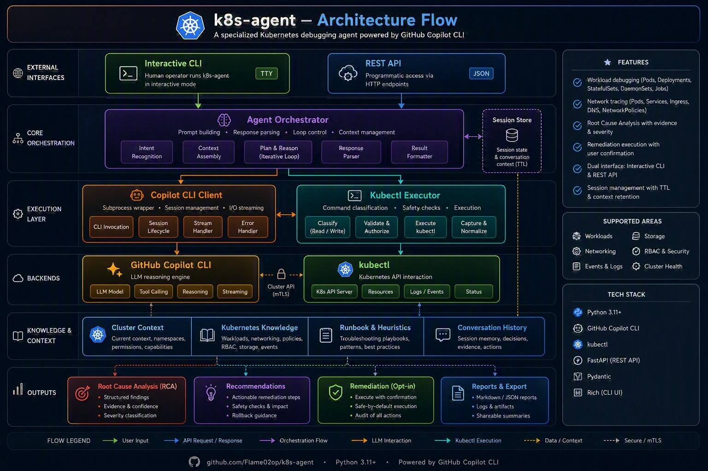

# K8s Agent

A specialized Kubernetes debugging agent powered by **GitHub Copilot CLI**. It diagnoses failing workloads, traces networking issues, provides detailed Root Cause Analysis (RCA), and can execute remediation steps upon confirmation.



## Features

- **Workload Debugging**: Automatically diagnoses failing Pods, Deployments, StatefulSets, DaemonSets, and Jobs.
- **Network Tracing**: Traces connectivity failures between pods, analyzes Services, Ingress, DNS, and NetworkPolicies.
- **Root Cause Analysis**: Provides structured RCA with evidence and severity classification.
- **Remediation Execution**: Suggests and (with confirmation) executes remediation commands.
- **Dual Interface**: Interactive CLI mode and REST API mode.
- **Session Management**: Maintains conversation context via Copilot CLI sessions with automatic TTL.

## Architecture

```
┌─────────────────────────────────────────────────────┐
│                    User Interface                   │
│         (Interactive CLI / REST API)                │
└──────────────────────┬──────────────────────────────┘
                       │
┌──────────────────────▼──────────────────────────────┐
│                 Agent Orchestrator                  │
│   (Prompt building, response parsing, loop control) │
└───────────┬──────────────────────────┬──────────────┘
            │                          │
┌───────────▼───────────┐  ┌───────────▼──────────────┐
│   Copilot CLI Client  │  │   Kubectl Executor       │
│  (subprocess wrapper, │  │  (command classification,│
│   session management) │  │   safe execution)        │
└───────────────────────┘  └──────────────────────────┘
            │                           │
┌───────────▼───────────┐  ┌────────────▼─────────────┐
│  GitHub Copilot CLI   │  │       kubectl            │
│  (LLM reasoning)      │  │  (cluster interaction)   │
└───────────────────────┘  └──────────────────────────┘
```

## Prerequisites

1. **Python 3.11+**
2. **kubectl** configured with access to your cluster
3. **GitHub Copilot CLI** installed and authenticated

   ```bash
   # Install GitHub Copilot CLI (ensure you have a Copilot license)
   # See: https://docs.github.com/en/copilot/github-copilot-in-the-cli
   gh extension install github/gh-copilot
   # Or install the standalone binary
   ```

4. **Authentication**: Ensure one of these environment variables is set:
   - `COPILOT_GITHUB_TOKEN`
   - `GH_TOKEN`
   - `GITHUB_TOKEN`

## Installation

```bash
# Clone the repository
git clone <repository-url>
cd k8s-agent

# Install the package
pip install -e .

# Or with development dependencies
pip install -e ".[dev]"
```

## Usage

### Interactive Mode

Launch the interactive debugging session:

```bash
k8s-agent interactive

# With specific namespace and context
k8s-agent interactive --namespace production --context prod-cluster

# With debug logging
k8s-agent interactive --log-level DEBUG
```

Inside the interactive session, you can use slash commands or natural language:

| Command | Description |
|---------|-------------|
| `/help` | Show available commands |
| `/scan [namespace]` | Scan for failing workloads |
| `/pod <name> [ns]` | Diagnose a specific pod |
| `/deploy <name> [ns]` | Diagnose a deployment |
| `/svc <name> [ns]` | Diagnose a service |
| `/dns <target> [pod] [ns]` | Diagnose DNS resolution |
| `/trace <src> <dst> [port] [ns]` | Trace network connectivity |
| `/netpol <pod> [ns]` | Diagnose NetworkPolicy issues |
| `/reset` | Reset the agent session |
| `/exit` | Exit the agent |

Or simply type your question:
```
k8s-agent> Why are pods in the payment namespace crashing?
k8s-agent> My frontend can't reach the backend service on port 8080
```

### Single-Shot Analysis

Run a one-off analysis without entering interactive mode:

```bash
k8s-agent analyze "Why is my nginx deployment failing?" --namespace default
k8s-agent analyze "Pods are in CrashLoopBackOff" --output json
k8s-agent scan --namespace production
```

### API Server Mode

Start the REST API server:

```bash
k8s-agent serve --port 8080 --workers 4
```

#### API Endpoints

| Method | Endpoint | Description |
|--------|----------|-------------|
| `GET` | `/health` | Health check and connectivity status |
| `POST` | `/analyze` | Submit a debugging query |
| `POST` | `/diagnose` | Diagnose a specific resource |
| `POST` | `/trace` | Trace network connectivity |
| `POST` | `/remediate` | Execute remediation steps |
| `GET` | `/scan` | Scan for failing workloads |
| `GET` | `/sessions` | List active sessions |
| `DELETE` | `/sessions/{id}` | Delete a session |

#### Example API Calls

```bash
# Analyze an issue
curl -X POST http://localhost:8080/analyze \
  -H "Content-Type: application/json" \
  -d '{
    "prompt": "Why is my nginx deployment failing in production?",
    "namespace": "production"
  }'

# Diagnose a specific resource
curl -X POST http://localhost:8080/diagnose \
  -H "Content-Type: application/json" \
  -d '{
    "resource_type": "deployment",
    "resource_name": "nginx",
    "namespace": "production"
  }'

# Trace network connectivity
curl -X POST http://localhost:8080/trace \
  -H "Content-Type: application/json" \
  -d '{
    "source_pod": "frontend-abc123",
    "target": "backend-service",
    "port": 8080,
    "namespace": "default"
  }'

# Execute remediation (requires session_id from previous response)
curl -X POST http://localhost:8080/remediate \
  -H "Content-Type: application/json" \
  -d '{
    "session_id": "k8s-agent-api-12345",
    "confirm": true,
    "step_indices": [0, 1]
  }'
```

## Configuration

Configuration is managed via environment variables (prefixed with `K8S_AGENT_`) or a `.env` file.

```bash
cp .env.example .env
# Edit .env with your settings
```

| Variable | Default | Description |
|----------|---------|-------------|
| `K8S_AGENT_COPILOT_BINARY` | `copilot` | Path to Copilot CLI binary |
| `K8S_AGENT_COPILOT_MODEL` | `auto` | LLM model to use |
| `K8S_AGENT_COPILOT_TIMEOUT` | `120` | Timeout per invocation (seconds) |
| `K8S_AGENT_KUBECTL_BINARY` | `kubectl` | Path to kubectl binary |
| `K8S_AGENT_KUBECTL_TIMEOUT` | `60` | Timeout per command (seconds) |
| `K8S_AGENT_KUBECTL_CONTEXT` | (current) | Kubernetes context |
| `K8S_AGENT_KUBECTL_NAMESPACE` | (current) | Default namespace |
| `K8S_AGENT_API_SESSION_TTL_SECONDS` | `3600` | API session TTL (1 hour) |
| `K8S_AGENT_MAX_DIAGNOSTIC_ITERATIONS` | `10` | Max LLM iterations per query |

## Session Management

### Interactive Mode
Each interactive session gets a unique name (e.g., `k8s-agent-1719300000-a1b2c3d4`). The session persists for the lifetime of the CLI process, maintaining full conversation context.

### API Mode
Sessions are time-bucketed with a configurable TTL (default: 1 hour). Requests within the same time window share a session and conversation context. After the TTL expires, a new session is automatically created.

You can also provide an explicit `session_id` in API requests to maintain your own session lifecycle.

## Safety Features

- **Command Classification**: All kubectl commands are classified as `read`, `write`, or `blocked`.
- **Write Confirmation**: Write commands require explicit user confirmation (CLI) or `confirm: true` (API).
- **Blocked Commands**: Dangerous commands (e.g., `kubectl proxy`) are blocked entirely.
- **Allowed Remediation List**: Only pre-approved command patterns can be executed as remediation.
- **Output Truncation**: Large kubectl outputs are truncated to prevent LLM context overflow.

## Development

```bash
# Install dev dependencies
make dev

# Run tests
make test

# Run with coverage
make test-coverage

# Lint
make lint

# Format code
make format
```

## Project Structure

```
k8s-agent/
├── src/k8s_agent/
│   ├── __init__.py
│   ├── config.py              # Configuration management
│   ├── core/
│   │   ├── agent.py           # Agent orchestration engine
│   │   ├── copilot_client.py  # Copilot CLI subprocess wrapper
│   │   └── kubectl.py         # Kubectl execution layer
│   ├── diagnostics/
│   │   ├── workload.py        # Workload diagnostic routines
│   │   └── network.py         # Network diagnostic routines
│   ├── cli/
│   │   ├── main.py            # Typer CLI entry point
│   │   └── interactive.py     # Interactive REPL
│   ├── api/
│   │   ├── server.py          # FastAPI application
│   │   ├── models.py          # Pydantic request/response models
│   │   └── session_manager.py # API session TTL management
│   └── utils/
│       └── logging.py         # Structured logging
├── tests/
├── configs/
├── Dockerfile
├── Makefile
├── pyproject.toml
├── .env.example
└── README.md
```

## License

MIT
